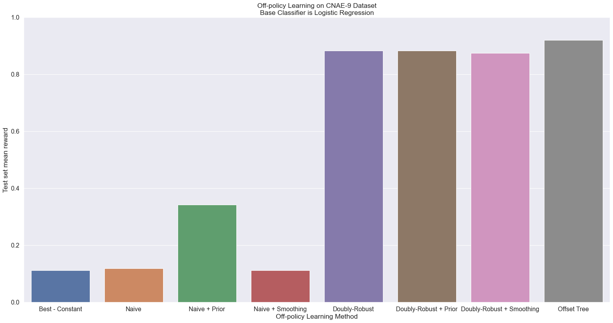
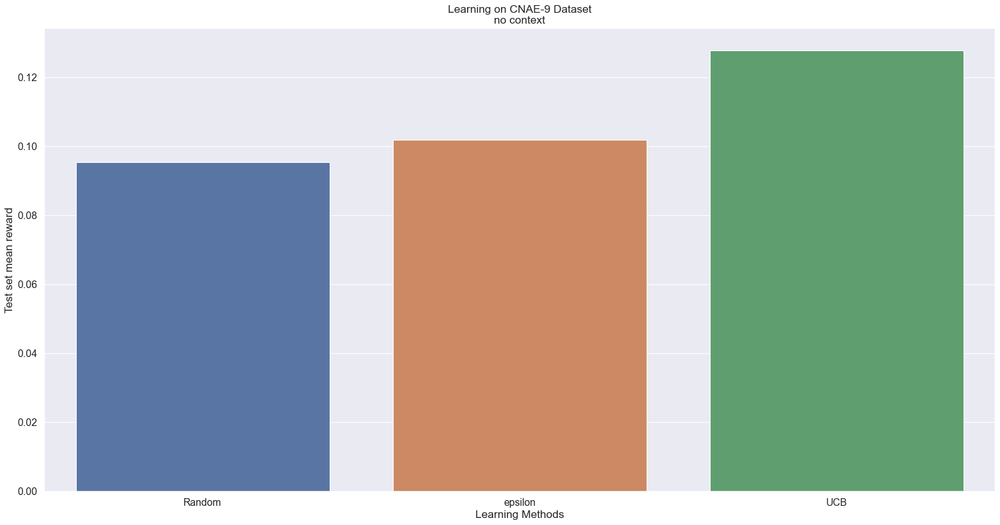

.. code:: ipython3

    import pandas as pd, numpy as np, re
    from sklearn.preprocessing import MultiLabelBinarizer
    
    ## Sk learn imports
    from sklearn.linear_model import LogisticRegression, Ridge
    
    ## contextualbandit package
    from contextualbandits.online import SeparateClassifiers
    from contextualbandits.offpolicy import OffsetTree
    from contextualbandits.offpolicy import DoublyRobustEstimator
    
    ## Plotting
    import matplotlib.pyplot as plt, pandas as pd
    import seaborn as sns
    
    from tqdm import tqdm
    import random
    import math
    
    
    from matplotlib import pyplot as plt
    from matplotlib.pyplot import ylim
    from matplotlib.pyplot import figure
    
    %matplotlib inline
    import mmap

.. code:: ipython3

    def get_num_lines(file_path):
        """Gets the number of lines that exists in the file in the provided filepath
        
        :param file_path: A string that provides the file path of the file that needs its lines counted.
        :type file_path: string, required
        
        :return: The number of lines in the file
        :rtype: int
        """
        fp = open(file_path, "r+")
        buf = mmap.mmap(fp.fileno(), 0)
        lines = 0
        while buf.readline():
            lines += 1
        return lines

.. code:: ipython3

    def parse_data(filename):
        """Extracts the features and predictions from the provided file
        
        :param filename: A string that provides the file path of the file that needs its lines counted.
        :type filename: string, required
        
        :return: Tuple with the features and expected predictions of those features
        :rtype: Tuple containing a list of lists and a list of ints
        """
        feature_list = []
        preds = []
        with open(filename, "rb") as f:
            for line in tqdm(f, total=get_num_lines(filename)):
                line = line.decode('ASCII').strip()
                features = line.split(',')
                preds.append(features[0])
                features = features[1:]
                feature_list.append(features)
        return feature_list, preds
    
    features, preds = parse_data("datasets/CNAE-9.data")

.. parsed-literal::

    100%|████████████████████████████████████████████████████████████████████████████████████████████████████████████████████████████████████████| 1080/1080 [00:00<00:00, 60044.12it/s]
    

.. code:: ipython3

    def clean_data(features, preds):
        """Cleans the provided features and predictions
        
        :param features: A list of features
        :type features: list, required
        
        :param preds: A list of expected predictions
        :type preds: list, required
        
        :return: Tuple with the cleaned features and expected predictions of those features
        :rtype: Tuple containing a numpy array of numpy arrays of ints and a numpy array  of ints
        """
        mlb = MultiLabelBinarizer()
        preds_list = [[i] for i in preds]
        preds_mlb = mlb.fit_transform(preds_list)
        features = np.array(features)
    
        temp = list(zip(features, preds_mlb))
        random.shuffle(temp)
        features, preds_mlb = zip(*temp)
    
        features = np.array(features).astype(int)
        preds_mlb = np.array(preds_mlb)
        return features, preds_mlb
    
    features, y = clean_data(features, preds)
    

.. code:: ipython3

    get_num_lines("datasets/CNAE-9.data")

.. parsed-literal::

    1080

.. code:: ipython3

    def CMAB_explore(features, y):
        """Explores the viablity of various CMAB algorithms using the provided features and predictions.
           Once it is done exploring it plots out the results of the exploration in a graph for comparison
        
        :param features: A numpy array of features
        :type features: numpy array, required
        
        :param y: A numpy array of expected predictions
        :type y: numpy array, required
        """
        
        ## We can see that there are 1080 rows to  explore so we can split the data into an exploration set
        ## initial test set
        ## and then an off-policy set
    
        # the 'explorer' polcy will be fit with this small sample of the rows
        st_seed = 0
        end_seed = 200
    
        # then it will choose actions for this larger sample
        st_exploration = 0
        end_exploration = 500
    
        # the new policy will be evaluated with a separate test set
        st_test = 500
        end_test = 1080
    
        # separating the covariates data for each case
        Xseed = features[st_seed:end_seed, :]
        Xexplore_sample = features[st_exploration:end_exploration, :]
        Xtest = features[st_test:end_test, :]
        nchoices = y.shape[1]
    
        # now constructing an exploration policy as explained above, with fully-labeled data
        explorer = LogisticRegression(solver="sag", max_iter=15000)
        explorer.fit(Xseed, np.argmax(y[st_seed:end_seed], axis=1))
    
        # letting the exploration policy choose actions which will then be used new policy input
        actions_explore_sample = explorer.predict(Xexplore_sample)
        rewards_explore_sample = y[st_exploration:end_exploration, :]\
                                [np.arange(end_exploration - st_exploration), actions_explore_sample]
    
        # extracting the probabilities it estimated
        ix_internal_actions = {j:i for i,j in enumerate(explorer.classes_)}
        ix_internal_actions = [ix_internal_actions[i] for i in actions_explore_sample]
        ix_internal_actions = np.array(ix_internal_actions)
        prob_actions_explore = explorer.predict_proba(Xexplore_sample)[np.arange(Xexplore_sample.shape[0]),
                                                                       ix_internal_actions]
        new_policy = SeparateClassifiers(base_algorithm=LogisticRegression(solver="sag", max_iter=15000),
                                         nchoices=y.shape[1], beta_prior=None, smoothing=None)
        new_policy.fit(X=Xexplore_sample, a=actions_explore_sample, r=rewards_explore_sample)
        mean_reward_naive = np.mean(y[st_test:end_test, :]\
                                     [np.arange(end_test - st_test), new_policy.predict(Xtest)])
        print("Test set mean reward - Separate Classifiers: ", mean_reward_naive)
        new_policy = SeparateClassifiers(base_algorithm=LogisticRegression(solver="sag", max_iter=15000),
                                         nchoices=y.shape[1], beta_prior="auto")
        new_policy.fit(X=Xexplore_sample, a=actions_explore_sample, r=rewards_explore_sample)
        mean_reward_beta = np.mean(y[st_test:end_test, :]\
                                    [np.arange(end_test - st_test), new_policy.predict(Xtest)])
        print("Test set mean reward - Separate Classifiers + Prior: ", mean_reward_beta)
        new_policy = SeparateClassifiers(base_algorithm=LogisticRegression(solver="sag", max_iter=15000),
                                         nchoices=y.shape[1], beta_prior=None, smoothing = (1,2))
        new_policy.fit(X=Xexplore_sample, a=actions_explore_sample, r=rewards_explore_sample)
        mean_reward_sm = np.mean(y[st_test:end_test, :]\
                                    [np.arange(end_test - st_test), new_policy.predict(Xtest)])
        print("Test set mean reward - Separate Classifiers + Smoothing: ", mean_reward_sm)
        new_policy = OffsetTree(base_algorithm=LogisticRegression(solver="sag", max_iter=15000), nchoices=y.shape[1])
        new_policy.fit(X=Xexplore_sample, a=actions_explore_sample, r=rewards_explore_sample, p=prob_actions_explore)
        mean_reward_ot = np.mean(y[st_test:end_test, :][np.arange(end_test - st_test), new_policy.predict(Xtest)])
        print("Test set mean reward - Offset Tree technique: ", mean_reward_ot)
        new_policy = DoublyRobustEstimator(base_algorithm = Ridge(),
                                           reward_estimator = LogisticRegression(solver="sag", max_iter=15000),
                                           nchoices = y.shape[1],
                                           method = 'rovr', beta_prior = None, smoothing = None)
        new_policy.fit(X=Xexplore_sample, a=actions_explore_sample, r=rewards_explore_sample, p=prob_actions_explore)
        mean_reward_dr = np.mean(y[st_test:end_test, :][np.arange(end_test - st_test), new_policy.predict(Xtest)])
        print("Test set mean reward - Doubly-Robust Estimator: ", mean_reward_dr)
        new_policy = DoublyRobustEstimator(base_algorithm = Ridge(),
                                           reward_estimator = LogisticRegression(solver="sag", max_iter=15000),
                                           nchoices = y.shape[1],
                                           method = 'rovr', beta_prior = "auto", smoothing = None)
        new_policy.fit(X=Xexplore_sample, a=actions_explore_sample, r=rewards_explore_sample, p=prob_actions_explore)
        mean_reward_dr_prior = np.mean(y[st_test:end_test, :][np.arange(end_test - st_test), new_policy.predict(Xtest)])
        print("Test set mean reward - Doubly-Robust Estimator + Prior: ", mean_reward_dr_prior)
        new_policy = DoublyRobustEstimator(base_algorithm = Ridge(),
                                           reward_estimator = LogisticRegression(solver="sag", max_iter=15000),
                                           nchoices = y.shape[1],
                                           method = 'rovr', beta_prior = None, smoothing = (1, 2))
        new_policy.fit(X=Xexplore_sample, a=actions_explore_sample, r=rewards_explore_sample, p=prob_actions_explore)
        mean_reward_dr_sm = np.mean(y[st_test:end_test, :][np.arange(end_test - st_test), new_policy.predict(Xtest)])
        print("Test set mean reward - Doubly-Robust Estimator + Smoothing: ", mean_reward_dr_sm)
        results = pd.DataFrame({
            'Off-policy Learning Method' : ['Best - Constant', 'Naive', 'Naive + Prior', 'Naive + Smoothing', 'Doubly-Robust',
                                            'Doubly-Robust + Prior', 'Doubly-Robust + Smoothing', 'Offset Tree'],
            'Test set mean reward' : [mean_constant, mean_reward_naive, mean_reward_beta, mean_reward_sm, mean_reward_dr,
                                      mean_reward_dr_prior, mean_reward_dr_sm, mean_reward_ot]
        })
        figure(figsize=(24, 12), dpi=80)
        ylim(top=1) 
        sns.set(font_scale = 1.3)
        sns.barplot(x = "Off-policy Learning Method", y="Test set mean reward", data=results)
        plt.title('Off-policy Learning on CNAE-9 Dataset\nBase Classifier is Logistic Regression')
        plt.show()
        
    CMAB_explore(features, y)

.. parsed-literal::

    Test set mean reward - Separate Classifiers:  0.11896551724137931
    Test set mean reward - Separate Classifiers + Prior:  0.3413793103448276
    Test set mean reward - Separate Classifiers + Smoothing:  0.11206896551724138
    Test set mean reward - Offset Tree technique:  0.9206896551724137
    Test set mean reward - Doubly-Robust Estimator:  0.8827586206896552
    Test set mean reward - Doubly-Robust Estimator + Prior:  0.8827586206896552
    Test set mean reward - Doubly-Robust Estimator + Smoothing:  0.8741379310344828
    

Random selection of CNAE-9
--------------------------

.. code:: ipython3

    def random_selection(y):
        """Explores the viablity of random selection for this dataset
        
        :param y: A numpy array of expected predictions
        :type y: numpy array, required
        
        :return: double that has the percentage of correct guesses
        :rtype: double
        """
        N = y.shape[0]
        d = y.shape[1]
        selected = []
        total_reward = 0
        rand_avgs = []
    
        for n in range(N):
            selection = random.randrange(d)
            selected.append(selection)
            reward = y[n][selection]
            total_reward += reward
            rand_average = total_reward/(n+1)
            rand_avgs.append(rand_average)
        return rand_avgs[-1]
    
    random_selection(y)

.. parsed-literal::

    0.1259259259259259

Epsilon greedy
--------------

.. code:: ipython3

    def E_greedy(y):
        """Explores the viablity of epsilon greedy selection for this dataset
        
        :param y: A numpy array of expected predictions
        :type y: numpy array, required
        
        :return: double that has the percentage of correct guesses
        :rtype: double
        """
        N = y.shape[0]
        d = y.shape[1]
        selected = []
        total_reward = 0  
    
        eps = 0.1
        average = [0] * d
        counts =  [0] * d
        rewards =  []
    
        epsilon_average = []
    
        for n in range(N):
            p = np.random.random()
    
            if p < eps:
                selection = np.random.choice(d)
            else:
                selection = np.argmax([a for a in average])
    
            reward = y[n][selection]
            total_reward += reward
            rewards.append(reward)
            average[selection] = (average[selection]*counts[selection] + reward)/(counts[selection] + 1)
            counts[selection] += 1
    
            e_average = total_reward/(n+1)
            epsilon_average.append(e_average)
    
        return epsilon_average[-1]
    
    E_greedy(y)

.. parsed-literal::

    0.10740740740740741

UCB
---

.. code:: ipython3

    def UCB(y):
        """Explores the viablity of UCB selection for this dataset
        
        :param y: A numpy array of expected predictions
        :type y: numpy array, required
        
        :return: double that has the percentage of correct guesses
        :rtype: double
        """
        N = y.shape[0]
        d = y.shape[1]
        selected = []
        total_reward = 0  
    
        UCB_averages = []
    
        numbers_of_selections = np.zeros(d)
        sums_of_reward = np.zeros(d)
    
        for n in range(N):
            max_upper_bound = 0
            ad = 0
            for i in range(0, d):
                if (numbers_of_selections[i] > 0):
                    average_reward = sums_of_reward[i] / numbers_of_selections[i]
                    delta_i = math.sqrt(2 * math.log(n+1) / numbers_of_selections[i])
                    upper_bound = average_reward + delta_i
                else:
                    upper_bound = 1e100
                if upper_bound > max_upper_bound:
                    max_upper_bound = upper_bound
                    selection = i
            selected.append(ad)
            numbers_of_selections[selection] += 1
            reward = y[n][selection]
            sums_of_reward[selection] += reward
            total_reward += reward
            average = total_reward/(n+1)
            UCB_averages.append(average)
        return UCB_averages[-1]
    UCB(y)

.. parsed-literal::

    0.12777777777777777

.. code:: ipython3

    def compare(y):
        """Compares the viablity of MAB algorithms on this data set
        
        :param y: A numpy array of expected predictions
        :type y: numpy array, required
        """
        figure(figsize=(24, 12), dpi=80)
        results = pd.DataFrame({
            'Learning Methods' : ['Random', 'epsilon', 'UCB'],
            'Test set mean reward' : [random_selection(y), E_greedy(y), UCB(y)]
        })
    
        sns.set(font_scale = 1.3)
        sns.barplot(x = "Learning Methods", y="Test set mean reward", data=results)
        plt.title('Learning on CNAE-9 Dataset\nno context')
        plt.show()
    compare(y)

